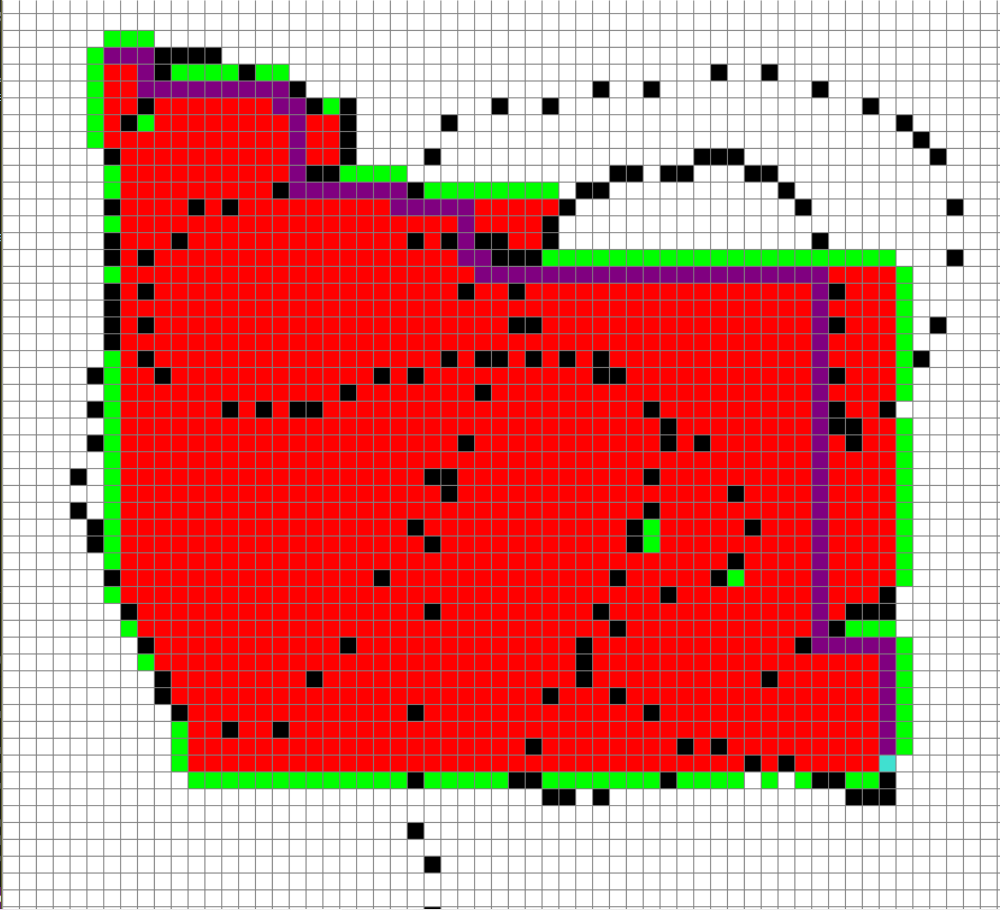

# pathfinding_visualizer

This project allows one to visualize the steps it would take to find the shortest path between one point and another. 

Sample run:

# TODO:
1. Add code description
2. Add alternative algorithms
